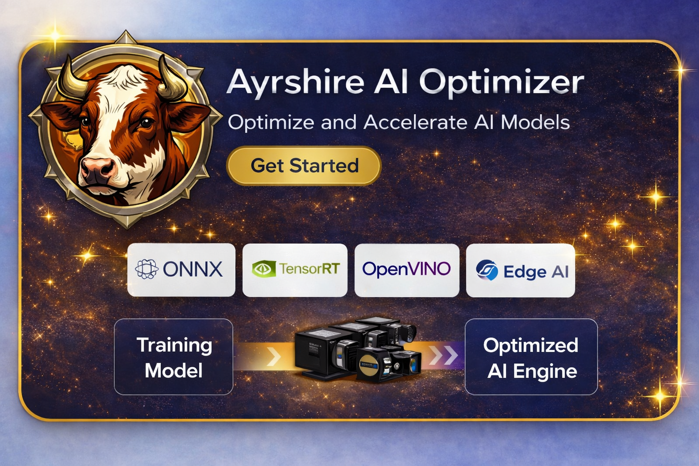

🇺🇸 <a href="README_eng.md">English</a> |
🇰🇷 <a href="README.md">한국어</a>

  

#  Ayrshire AI Model Optimizer

Ayrshire AI Model Optimizer는 다양한 AI 추론 환경에서 사용할 수 있도록\
딥러닝 모델을 **자동으로 최적화하고 실행 가능한 형태로 변환하는
기능**입니다.

AI 모델을 실제 산업 환경에 적용할 때 발생하는 **성능, 지연시간, 하드웨어
호환성 문제**를 해결하기 위해 설계되었습니다.

Ayrshire Optimizer를 사용하면 하나의 모델을 다양한 AI 추론 플랫폼에서
안정적으로 사용할 수 있습니다.

------------------------------------------------------------------------

# 주요 기능

## 다양한 AI 추론 플랫폼 지원

Ayrshire Optimizer는 여러 AI 실행 환경에 맞게 모델을 변환하고 최적화할 수
있습니다.

지원 플랫폼

-   ONNX Runtime
-   NVIDIA TensorRT
-   Intel OpenVINO
-   CPU / GPU 환경

이를 통해 **Windows, Linux, Edge AI 장치 등 다양한 환경에서 동일한
모델을 사용할 수 있습니다.**

------------------------------------------------------------------------

## AI 모델 자동 최적화

AI 모델을 실제 서비스 환경에 맞게 자동으로 최적화합니다.

최적화를 통해

-   추론 속도 향상
-   지연 시간 감소
-   메모리 사용량 개선
-   다양한 하드웨어 환경 지원

을 가능하게 합니다.

------------------------------------------------------------------------

## 산업용 AI 환경에 최적화

Ayrshire Optimizer는 특히 다음과 같은 환경을 고려하여 설계되었습니다.

-   머신비전 검사 시스템
-   Edge AI 장치
-   산업용 검사 장비
-   실시간 영상 분석 시스템

------------------------------------------------------------------------

## 다양한 하드웨어 환경 지원

다양한 AI 하드웨어 환경에서 사용할 수 있습니다.

예시

-   Industrial PC
-   NVIDIA GPU
-   Edge AI Board
-   CPU 기반 시스템

------------------------------------------------------------------------

# 사용 목적

Ayrshire AI Optimizer는 다음과 같은 환경에서 활용될 수 있습니다.

-   머신비전 검사 시스템
-   산업용 AI 검사 장비
-   Edge AI 장치
-   실시간 영상 분석 시스템

------------------------------------------------------------------------

# 전체 구조

    AI 모델
       ↓
    Ayrshire Model Optimizer
       ↓
    최적화된 추론 엔진
       ↓
    AI 검사 시스템 (Window) / Edge AI 장치 (Linux)

------------------------------------------------------------------------

# 특징

-   다양한 AI 추론 플랫폼 지원
-   자동 모델 최적화
-   Edge AI 환경 지원
-   산업용 시스템 적용 가능
-   안정적인 AI 추론 실행

------------------------------------------------------------------------

# GAUR AI Inference Engine

Ayrshire AI Model Optimizer는\
**GAUR AI Inference Engine의 핵심 구성 요소 중 하나입니다.**

AI 모델을 실제 서비스 환경에서 사용할 수 있도록\
**최적화 및 실행 환경을 구성하는 역할**을 수행합니다.

------------------------------------------------------------------------

# Repository Scope

이 저장소는 AI Optimizer 구조를 제공합니다.

실제 상용 AI 및 소스 코드는 포함되어 있지 않습니다.

------------------------------------------------------------------------

# BISON AI Vision Lab

스마트 제조를 위한 산업용 AI 검사 기술
